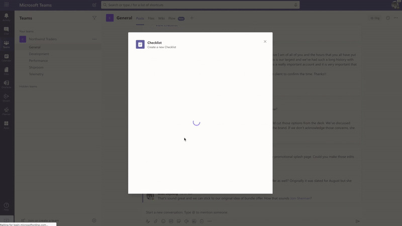

# Checklist App Template

Checklist is a custom [Teams message extension](https://docs.microsoft.com/en-us/microsoftteams/platform/messaging-extensions/what-are-messaging-extensions) app that enables you to collaborate with your team by creating a shared checklist in a chat or channel. Checklist app is supported across all platforms – Teams desktop, browser, iOS, and Android clients. It is ready for deployment as part of your existing Microsoft 365 subscription.

* [Solution overview](Solution-overview.md)
* Deploying the app
    * [Deployment guide](Deployment-guide.md)